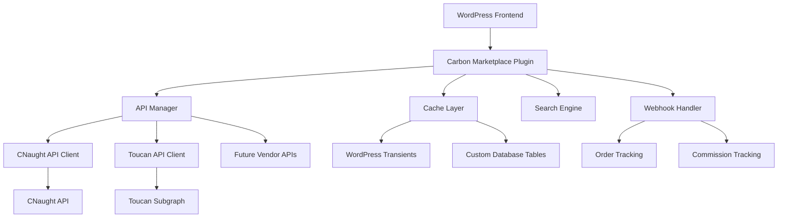
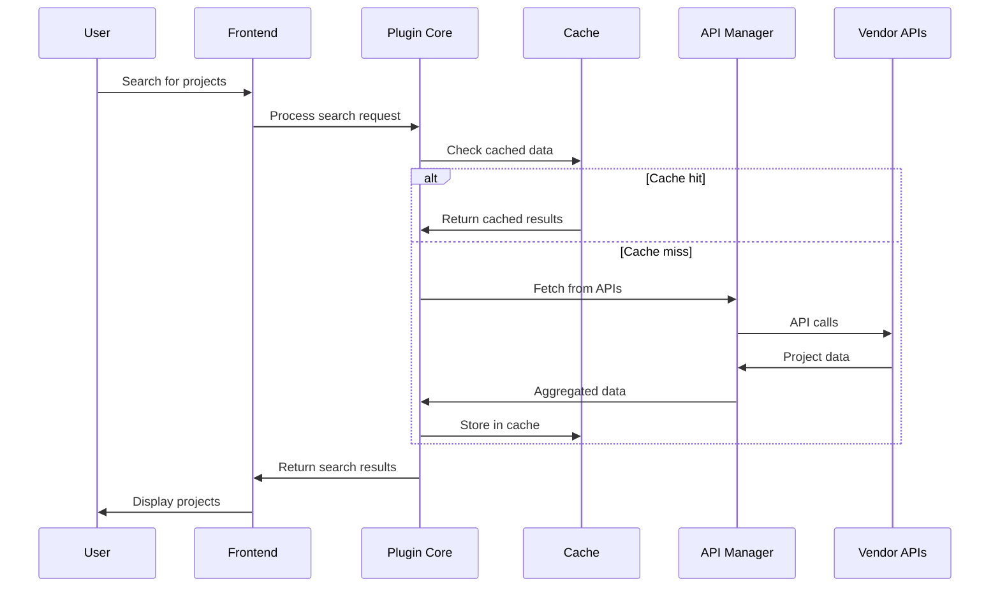

# Design Document

## Overview

The Carbon Marketplace Integration is a WordPress plugin that transforms a website into a meta search engine for carbon offset projects. The system integrates with multiple vendor APIs (CNaught and Toucan) to provide real-time project listings, search functionality, and affiliate-style checkout processes. The architecture follows WordPress best practices with a modular design that supports multiple API vendors and provides caching for optimal performance.

## Architecture

### High-Level Architecture



### Component Interaction Flow



## Components and Interfaces

### 1. Plugin Core (`CarbonMarketplace` class)

**Responsibilities:**
- Plugin initialization and lifecycle management
- Shortcode registration for Elementor integration
- Admin menu and settings page registration
- Webhook endpoint registration

**Key Methods:**
```php
public function init()
public function register_shortcodes()
public function register_admin_menus()
public function register_webhook_endpoints()
```

### 2. API Manager (`ApiManager` class)

**Responsibilities:**
- Coordinate calls to multiple vendor APIs
- Aggregate and normalize data from different sources
- Handle API authentication and rate limiting
- Implement retry logic with exponential backoff

**Key Methods:**
```php
public function fetch_all_portfolios(): array
public function fetch_project_details(string $project_id, string $vendor): ProjectDetails
public function get_quote(float $amount_kg, ?string $portfolio_id = null): Quote
public function create_checkout_session(CheckoutRequest $request): CheckoutSession
```

### 3. Vendor API Clients

#### CNaught API Client (`CNaughtClient` class)
```php
public function get_portfolios(): array
public function get_portfolio_details(string $portfolio_id): Portfolio
public function get_project_details(string $project_id): Project
public function create_quote(QuoteRequest $request): Quote
public function create_checkout_session(CheckoutRequest $request): CheckoutSession
```

#### Toucan API Client (`ToucanClient` class)
```php
public function fetch_all_tco2_tokens(): array
public function fetch_tco2_token_by_id(string $token_id): TCO2Token
public function fetch_pool_contents(string $pool_address): array
public function fetch_token_price_on_dex(string $token_address): TokenPrice
```

### 4. Cache Layer (`CacheManager` class)

**Responsibilities:**
- Manage WordPress transients for API data
- Implement TTL-based cache invalidation
- Handle cache warming and background refresh

**Key Methods:**
```php
public function get_cached_portfolios(): ?array
public function cache_portfolios(array $portfolios, int $ttl = 900): void
public function get_cached_project(string $project_id): ?Project
public function invalidate_cache(string $cache_key): void
```

### 5. Search Engine (`SearchEngine` class)

**Responsibilities:**
- Index project data for fast searching
- Implement filtering by location, project type, price range
- Handle search query parsing and result ranking

**Key Methods:**
```php
public function index_projects(array $projects): void
public function search(SearchQuery $query): SearchResults
public function apply_filters(array $projects, array $filters): array
```

### 6. Frontend Components

#### Search Interface (`SearchWidget` class)
- Elementor widget for search form
- AJAX-powered real-time search
- Filter controls for location, project type, price range

#### Project Display (`ProjectGrid` and `ProjectCard` classes)
- Grid layout for search results
- Individual project cards with key information
- Pagination and infinite scroll support

#### Project Detail Page (`ProjectDetailPage` class)
- Comprehensive project information display
- Real-time pricing integration
- Purchase/quote buttons with vendor routing

### 7. Webhook Handler (`WebhookHandler` class)

**Responsibilities:**
- Process incoming webhooks from vendor APIs
- Update order status and commission tracking
- Trigger email notifications and admin alerts

**Key Methods:**
```php
public function handle_cnaught_webhook(array $payload): void
public function handle_order_completion(OrderCompletionEvent $event): void
public function update_commission_tracking(string $order_id, float $commission): void
```

## Data Models

### Project Data Model
```php
class Project {
    public string $id;
    public string $vendor;
    public string $name;
    public string $description;
    public string $location;
    public string $project_type;
    public string $methodology;
    public float $price_per_kg;
    public int $available_quantity;
    public array $images;
    public array $sdgs;
    public string $registry_url;
    public DateTime $created_at;
    public DateTime $updated_at;
}
```

### Portfolio Data Model
```php
class Portfolio {
    public string $id;
    public string $vendor;
    public string $name;
    public string $description;
    public array $projects;
    public float $base_price_per_kg;
    public bool $is_active;
}
```

### Search Query Model
```php
class SearchQuery {
    public ?string $keyword;
    public ?string $location;
    public ?string $project_type;
    public ?float $min_price;
    public ?float $max_price;
    public int $limit = 20;
    public int $offset = 0;
}
```

### Order Tracking Model
```php
class Order {
    public string $id;
    public string $vendor_order_id;
    public string $vendor;
    public float $amount_kg;
    public float $total_price;
    public string $status;
    public ?string $retirement_certificate;
    public array $project_allocations;
    public DateTime $created_at;
    public DateTime $completed_at;
}
```

## Error Handling

### API Error Handling Strategy

1. **Rate Limiting**: Implement exponential backoff for 429 responses
2. **Network Errors**: Retry with increasing delays (1s, 2s, 4s, 8s)
3. **Authentication Errors**: Log and alert administrators immediately
4. **Data Validation**: Sanitize and validate all API responses
5. **Graceful Degradation**: Show cached data when APIs are unavailable

### Error Logging
```php
class ErrorLogger {
    public function log_api_error(string $vendor, string $endpoint, Exception $error): void
    public function log_webhook_error(string $webhook_type, array $payload, Exception $error): void
    public function alert_admin(string $message, string $severity = 'error'): void
}
```

## Testing Strategy

### Unit Testing
- Test all API client methods with mocked responses
- Test search engine filtering and ranking algorithms
- Test cache layer TTL and invalidation logic
- Test webhook payload processing

### Integration Testing
- Test complete user flows from search to purchase
- Test API integration with sandbox environments
- Test webhook delivery and processing
- Test Elementor widget integration

### Performance Testing
- Load test search functionality with large datasets
- Test cache performance under high traffic
- Test API rate limiting and backoff behavior
- Monitor memory usage during data synchronization

### Security Testing
- Test API credential storage and encryption
- Test webhook signature verification
- Test input sanitization and validation
- Test SQL injection prevention in search queries

## Database Schema

### Custom Tables

#### `wp_carbon_projects`
```sql
CREATE TABLE wp_carbon_projects (
    id BIGINT(20) UNSIGNED NOT NULL AUTO_INCREMENT,
    vendor_id VARCHAR(255) NOT NULL,
    vendor VARCHAR(50) NOT NULL,
    name VARCHAR(255) NOT NULL,
    description TEXT,
    location VARCHAR(255),
    project_type VARCHAR(100),
    methodology VARCHAR(255),
    price_per_kg DECIMAL(10,4),
    available_quantity INT,
    data JSON,
    created_at DATETIME DEFAULT CURRENT_TIMESTAMP,
    updated_at DATETIME DEFAULT CURRENT_TIMESTAMP ON UPDATE CURRENT_TIMESTAMP,
    PRIMARY KEY (id),
    UNIQUE KEY vendor_project (vendor, vendor_id),
    KEY location (location),
    KEY project_type (project_type),
    KEY price_per_kg (price_per_kg)
);
```

#### `wp_carbon_orders`
```sql
CREATE TABLE wp_carbon_orders (
    id BIGINT(20) UNSIGNED NOT NULL AUTO_INCREMENT,
    vendor_order_id VARCHAR(255) NOT NULL,
    vendor VARCHAR(50) NOT NULL,
    user_id BIGINT(20) UNSIGNED,
    amount_kg DECIMAL(10,4) NOT NULL,
    total_price DECIMAL(10,2) NOT NULL,
    currency VARCHAR(3) DEFAULT 'USD',
    status VARCHAR(50) NOT NULL,
    project_allocations JSON,
    retirement_data JSON,
    commission_amount DECIMAL(10,2),
    created_at DATETIME DEFAULT CURRENT_TIMESTAMP,
    completed_at DATETIME NULL,
    PRIMARY KEY (id),
    UNIQUE KEY vendor_order (vendor, vendor_order_id),
    KEY user_id (user_id),
    KEY status (status),
    KEY created_at (created_at)
);
```

## Security Considerations

### API Security
- Store API credentials encrypted in WordPress options
- Use WordPress nonces for all AJAX requests
- Implement rate limiting for search requests
- Validate and sanitize all user inputs

### Webhook Security
- Verify webhook signatures from vendor APIs
- Use HTTPS-only endpoints for webhook delivery
- Implement replay attack prevention
- Log all webhook attempts for audit trails

### Data Protection
- Encrypt sensitive order information
- Implement data retention policies
- Provide GDPR-compliant data export/deletion
- Anonymize analytics data

## Performance Optimization

### Caching Strategy
- Cache portfolio data for 15 minutes (configurable)
- Cache project details for 1 hour (configurable)
- Use WordPress object cache for frequently accessed data
- Implement cache warming via WP-Cron

### Database Optimization
- Index frequently queried columns
- Use JSON columns for flexible vendor-specific data
- Implement database query optimization
- Regular cleanup of old order data

### Frontend Optimization
- Lazy load project images
- Implement infinite scroll for search results
- Use AJAX for real-time search without page reloads
- Minify and compress CSS/JS assets

## Monitoring and Analytics

### Performance Monitoring
- Track API response times and error rates
- Monitor cache hit/miss ratios
- Log slow database queries
- Track user engagement metrics

### Business Metrics
- Conversion rates by vendor and project type
- Average order values and commission earnings
- Popular search terms and filters
- User journey analytics from search to purchase